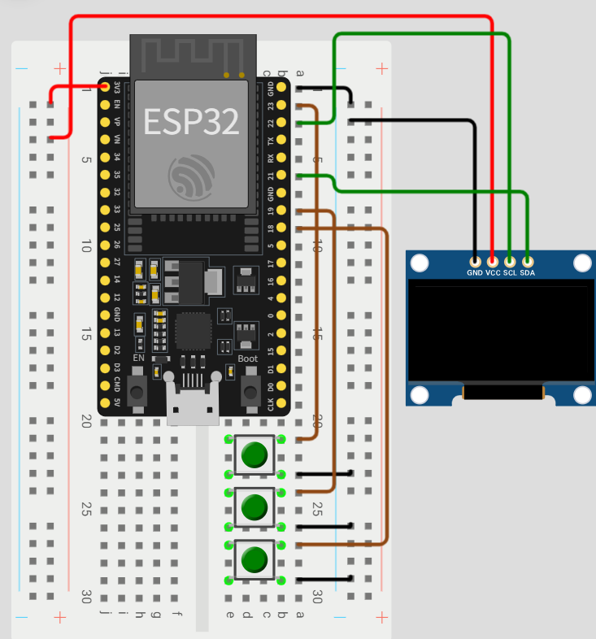

# Capstone_design_mechanics_spacemouse-esp32-cobot-joystick
ESP32 reads 6-DoF SpaceMouse over UART and streams commands to a PC/Python controller for real-time cobot jogging (OLED/buttons/battery included).

